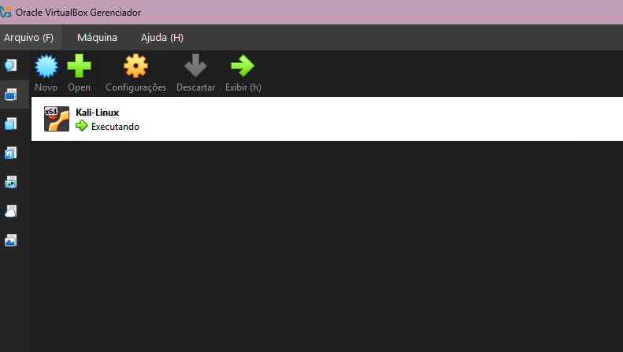
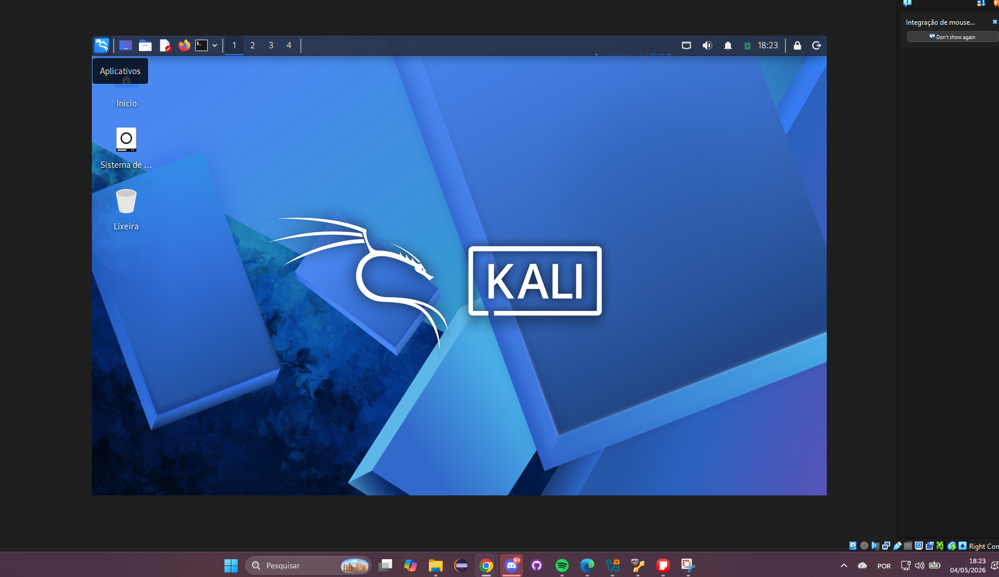
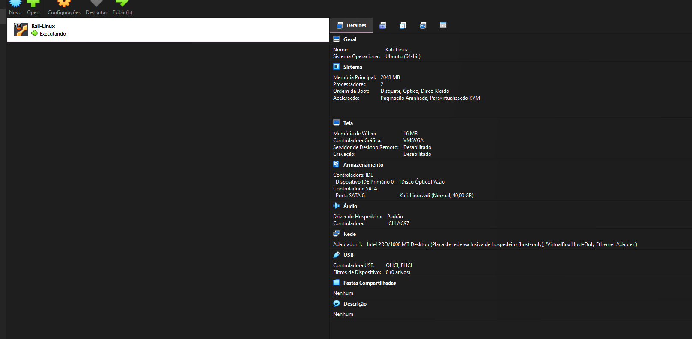
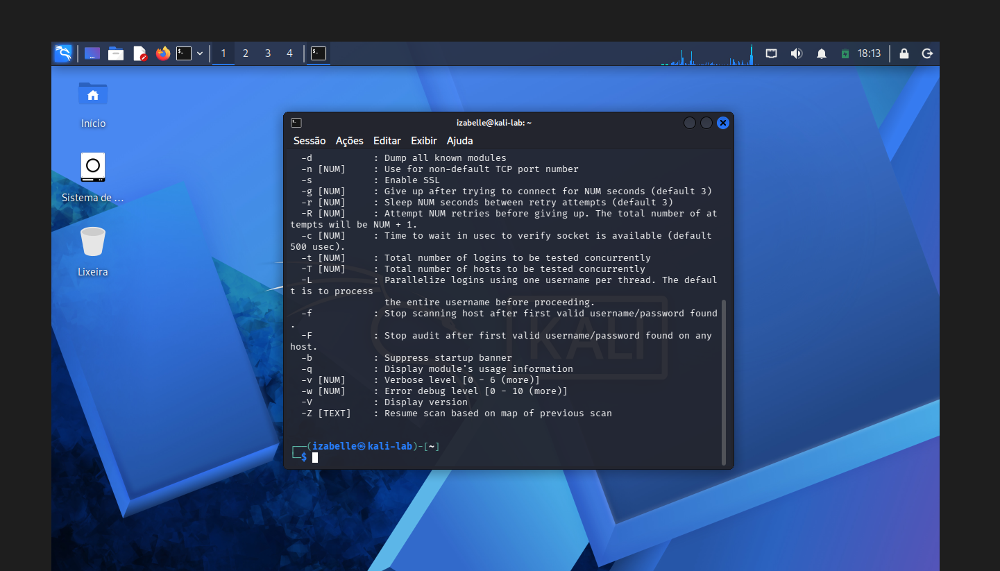
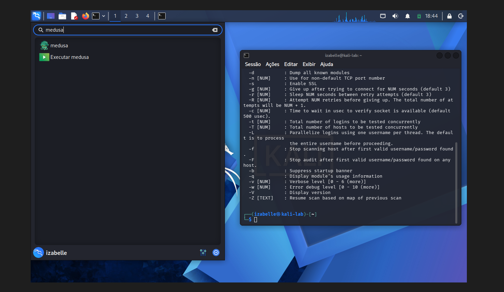

# Lab Setup Evidence

## Objective

This document presents the initial evidence of the cybersecurity lab environment configured for this project.

The goal is to document the setup process and demonstrate that the Kali Linux virtual machine was installed, configured, and prepared for controlled cybersecurity testing.

## Current Lab Status

| Component | Status |
|---|---|
| VirtualBox | Configured |
| Kali Linux VM | Configured and running |
| Host-only Network | Configured |
| Medusa | Available in Kali Linux |
| Nmap | To be validated |
| Metasploitable 2 VM | Pending configuration |
| DVWA | Pending configuration |

## Evidence 1 — VirtualBox Kali Linux VM

The first evidence shows the Kali Linux virtual machine created inside VirtualBox.



## Evidence 2 — Kali Linux Desktop Running

The second evidence shows Kali Linux running successfully after installation.



## Evidence 3 — Host-only Network Configuration

The third evidence shows the Kali Linux virtual machine configured with a host-only network adapter.

This configuration is important because it keeps the lab isolated and allows communication between virtual machines without exposing the tests to external networks.



## Evidence 4 — Kali Linux System Information

The fourth evidence shows basic system and network information collected from the Kali Linux terminal.

The commands used were:

```bash
uname -a
ip a
whoami
```
These commands validate the operating system, the network interface, and the current logged-in user.



## Evidence 5 — Medusa Tool Validation

The fifth evidence shows that the Medusa tool is available in the Kali Linux environment.

This confirms that the password auditing tool required for the next stages of the project can be accessed from the terminal.


