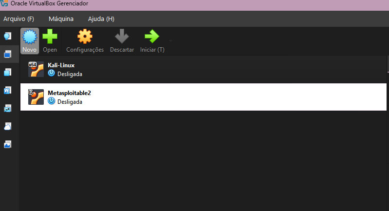
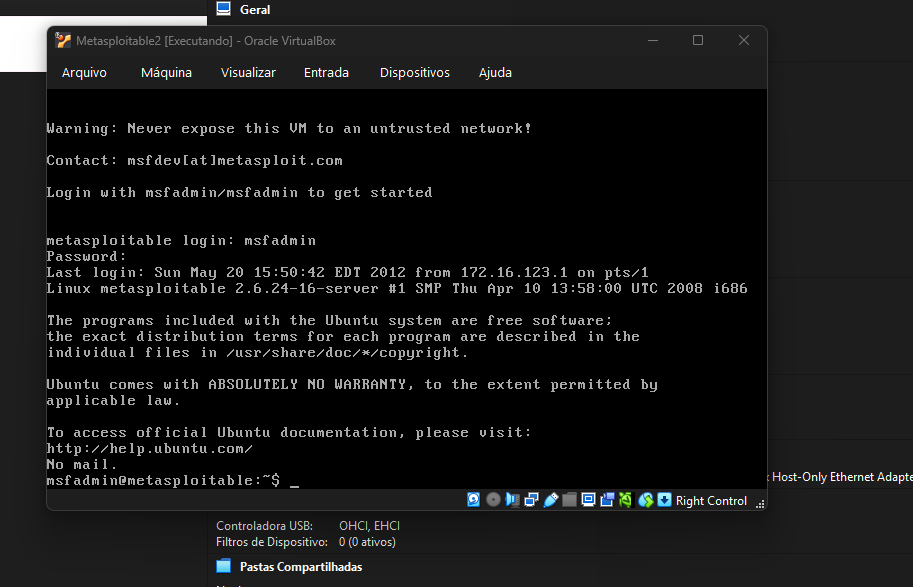
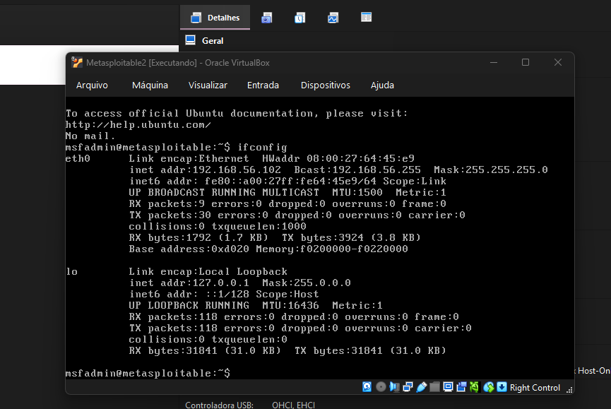
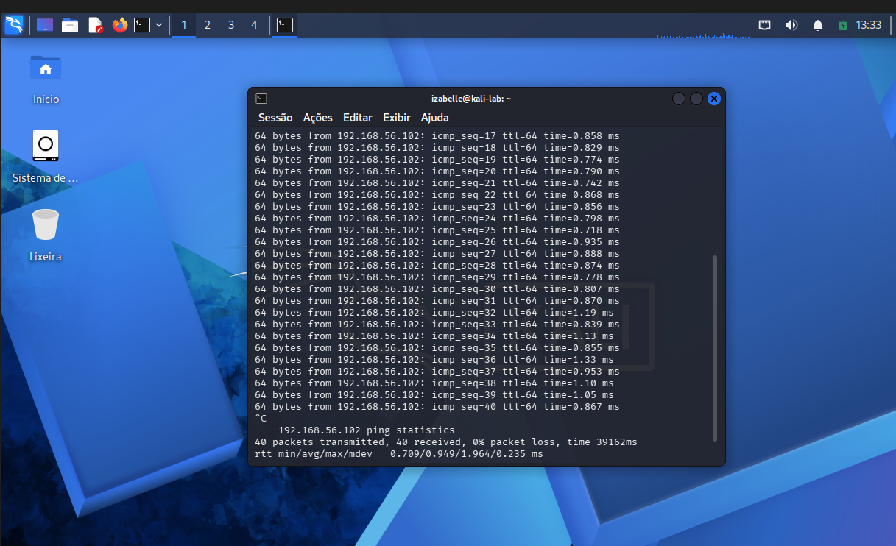

# Target Machine Setup

## Objective

This document describes the configuration of the vulnerable target machine used in the cybersecurity lab.

The target machine selected for this project is Metasploitable 2, an intentionally vulnerable virtual machine used only in a local, isolated, and controlled environment for educational purposes.

## Target Machine Overview

| Item | Configuration |
|---|---|
| Machine name | Metasploitable2 |
| Operating system | Ubuntu 32-bit |
| Memory | 1024 MB |
| Disk | Metasploitable.vmdk |
| Network mode | Host-only Adapter |
| Lab IP address | 192.168.56.102 |

## Purpose of the Target Machine

Metasploitable 2 is used as the vulnerable machine in this lab.

Its purpose is to provide a safe environment for practicing:

- Network scanning;
- Service enumeration;
- Vulnerability identification;
- Controlled authentication testing;
- Security documentation;
- Defensive recommendations.

This machine must not be exposed to public or untrusted networks.

## Network Configuration

The Metasploitable 2 virtual machine was configured using a host-only network adapter.

This configuration allows communication between the Kali Linux machine and the Metasploitable 2 machine while keeping the lab isolated from external networks.

## Evidence 1 — Metasploitable 2 VM Created

The first evidence shows the Metasploitable 2 virtual machine created inside VirtualBox.



## Evidence 2 — Host-only Network Configuration

The second evidence shows the Metasploitable 2 virtual machine configured with a host-only network adapter.


## Evidence 3 — Metasploitable 2 Running

The third evidence shows the Metasploitable 2 virtual machine running successfully.



## Evidence 4 — Metasploitable 2 IP Address

The fourth evidence shows the IP address assigned to the Metasploitable 2 machine.

The IP identified in the lab was:

```text
192.168.56.102
```



## Evidence 5 — Connectivity Test from Kali Linux

The fifth evidence shows the Kali Linux machine successfully communicating with Metasploitable 2 using the `ping` command.

The command used was:

```bash
ping 192.168.56.102
```

The response confirms that both virtual machines are connected in the same host-only network.


