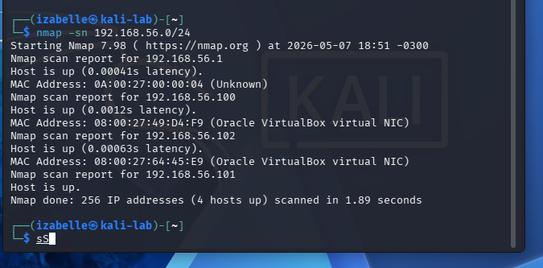
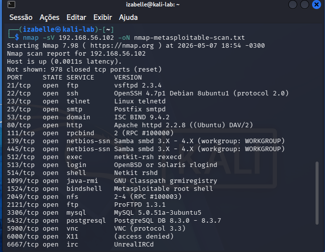
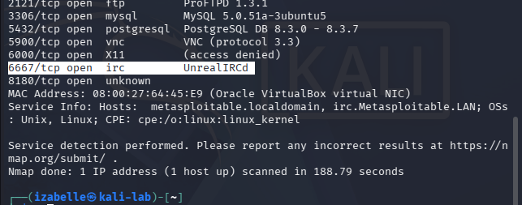

# Network Scanning with Nmap

## Objective

This document describes the network scanning phase of the cybersecurity lab.

The goal of this phase is to identify active hosts, open ports, and running services in the controlled host-only network.

## Lab Context

At this stage, the lab environment includes:

| Machine | Role | IP Address |
|---|---|---|
| Kali Linux | Analysis machine | 192.168.56.101 |
| Metasploitable 2 | Vulnerable target machine | 192.168.56.102 |

All tests were performed in a local and isolated host-only network.

## Tool Used

The tool used in this stage was Nmap.

Nmap was used to perform host discovery and service scanning against the vulnerable target machine.

## Evidence 1 — Host Discovery

The first evidence shows the host discovery scan performed against the host-only network.

Command used:

```bash
nmap -sn 192.168.56.0/24
```

This command was used to identify active hosts in the lab network.



## Evidence 2 — Service Scan

The second evidence shows the service scan performed against the Metasploitable 2 machine.

Command used:

```bash
nmap -sV 192.168.56.102 -oN nmap-metasploitable-service-scan.txt
```

This command was used to identify open ports and running services on the target machine.





## Output File

The scan result was also saved as a text file using the `-oN` option.

The output file is available at:

```text
logs/nmap-metasploitable-service-scan.txt
```

## Initial Findings

The Nmap scan identified several open ports and services on the Metasploitable 2 machine.

Some relevant services identified include:

| Port | Service | Observation |
|---|---|---|
| 21/tcp | FTP | Relevant for the FTP authentication testing scenario |
| 22/tcp | SSH | Remote access service identified |
| 23/tcp | Telnet | Insecure remote access service |
| 80/tcp | HTTP | Web service available |
| 139/tcp | NetBIOS-SSN | Related to SMB/Windows networking |
| 445/tcp | SMB | Relevant for SMB enumeration and password spraying scenario |
| 3306/tcp | MySQL | Database service identified |
| 5432/tcp | PostgreSQL | Database service identified |

## Security Notes

This scan was performed only against the local Metasploitable 2 virtual machine in a controlled lab environment.

No public IP addresses, third-party systems, or unauthorized networks were scanned.

## Result

The Nmap scan successfully identified open ports and running services on the vulnerable target machine.

This information will be used in the next phases of the project to select services for enumeration and controlled authentication testing.

## Next Steps

The next steps of the project will include:

- Creating sample username and password files;
- Preparing controlled FTP authentication testing;
- Preparing SMB enumeration and password spraying documentation;
- Documenting risks and mitigation measures.
